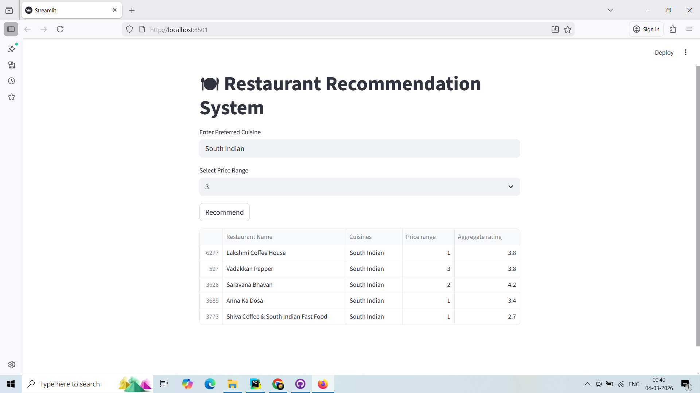

# 🍽 Restaurant Recommendation System

A Machine Learning-based Restaurant Recommendation System built using **Content-Based Filtering (TF-IDF + Cosine Similarity)**.

This system recommends restaurants based on:
- ✅ Preferred Cuisine
- ✅ Price Range

The project follows a modular, scalable architecture and includes both CLI and Streamlit web interface versions.

---

## 🚀 Features

- Data preprocessing & cleaning
- Feature engineering using TF-IDF
- Cosine similarity-based recommendation engine
- Modular folder structure (industry-style)
- Command-line interface (CLI)
- Streamlit interactive web app
- Scalable and production-ready structure

---

## 🧠 Tech Stack

- Python
- Pandas
- NumPy
- Scikit-learn
- Streamlit

---

## 📂 Project Structure

```
restaurant_recommendation_system/
│
├── data/
│   └── Dataset.csv
│
├── screenshots/
│   └── app_ui.png
│
├── src/
│   ├── __init__.py
│   ├── config.py
│   ├── data/poppercessing/
│   │   └── preprocess.py
│   ├── feature_engineering/
│   │   └── vectorizer.py
│   ├── model/
│   │   └── recommender.py
│   └── utils/
│       └── helper.py
│
├── main.py
├── app.py
├── requirements.txt
└── README.md
```

---

## 📸 Application Screenshot

### 🖥️ Streamlit Web Interface



> The web interface allows users to enter preferred cuisine and price range to get personalized restaurant recommendations instantly.

---

## ⚙️ Installation Guide

### 1️⃣ Clone the Repository

```bash
git clone https://github.com/your-username/restaurant-recommendation-system.git
cd restaurant-recommendation-system
```

### 2️⃣ Create Virtual Environment (Recommended)

```bash
python -m venv venv
```

Activate:

**Windows**
```bash
venv\Scripts\activate
```

**Mac/Linux**
```bash
source venv/bin/activate
```

### 3️⃣ Install Dependencies

```bash
pip install -r requirements.txt
```

---

## ▶️ Running the Project

### Option 1: Run CLI Version

```bash
python main.py
```

### Option 2: Run Streamlit Web App

```bash
streamlit run app.py
```

Then open your browser:

```
http://localhost:8501
```

---

## 🧪 How It Works

1. Load and clean the dataset
2. Combine cuisine and price range into a single feature
3. Apply TF-IDF vectorization
4. Compute cosine similarity
5. Recommend top N similar restaurants

---

## 📊 Sample Input

Cuisine: South Indian  
Price Range: 1  

### Sample Output

| Restaurant Name   | Cuisines      | Price Range | Aggregate Rating |
|------------------|--------------|------------|------------------|
| Udupi Bhavan    | South Indian | 1          | 4.3              |
| Sangeetha Veg   | South Indian | 1          | 4.1              |
| Saravana Bhavan | South Indian | 1          | 4.0              |

(Note: Output depends on dataset content.)

---

## 📈 Future Improvements

- Add location-based filtering
- Add minimum rating filter
- Hybrid recommendation system
- FastAPI backend integration
- Docker containerization
- Cloud deployment (AWS / Render)

---

## 🏆 Resume-Ready Description

Developed a modular Restaurant Recommendation System using TF-IDF vectorization and cosine similarity to deliver personalized restaurant suggestions based on cuisine and pricing preferences. Designed scalable architecture separating preprocessing, feature engineering, and recommendation logic.

---

## 👨‍💻 Author

Balaji U
Software Engineer (Backend) | Python | Scalable APIs | FastAPI | PostgreSQL | AI Integration

---

## 📜 License

This project is created for educational and portfolio purposes.
